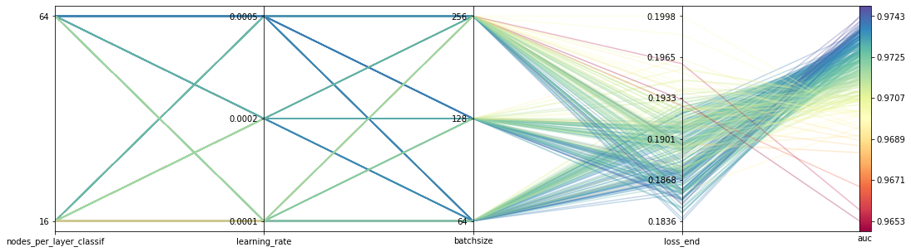
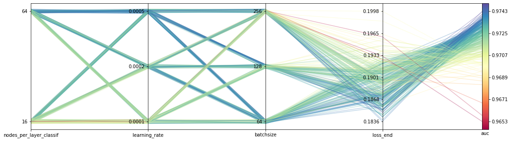
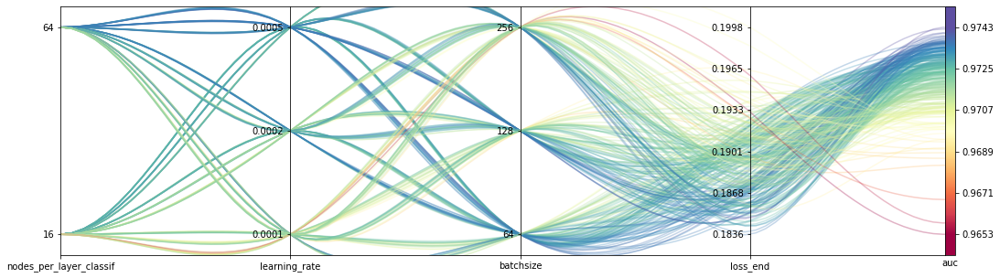
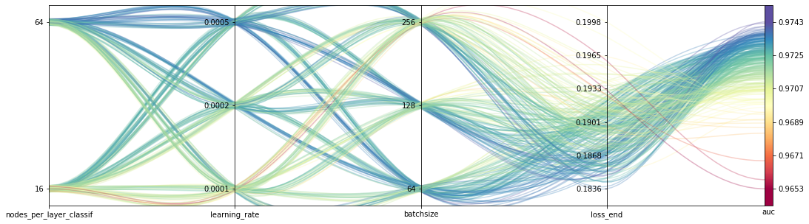

# Parallel Coordinates Plot
Produce parallel coordinate plot from pandas dataframe with respect to any value not just class.

In case the pandas.plotting function is a bit too rigid, enables the easy use of some continuous quantity with additional colourbar, instead of assuming class based line grouping.

Additionally can handle categorical data types, and treats columns with only a handful of unique entries as categorical.

Useful for visualising hyperparameter scans for deep learning models, with hyperparameter options saved as columns in a dataframe.

Optionally specify a spread to add around categorical points for easier visualisation.

Alternatively switch to curved lines

Or both!

